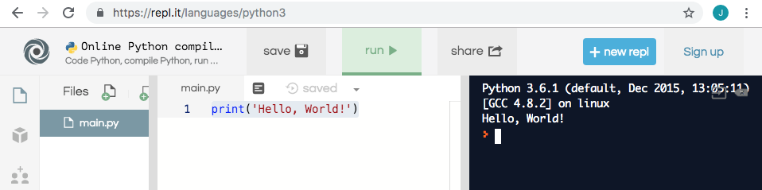

# 1. Hello, World!

This is your first problem. Using your favorite IDE, print 'Hello, World!', and submit your code once it's complete.

```bash
# Input
N/A

# Output
Hello, World!
```

\[Submit your code here\]


If you use Python, use Visual Studio Code or click [here](https://repl.it/languages/python3) to launch an online python editor.

If you use Java, use Eclipse or IntelliJ, or click [here](https://repl.it/languages/java) to launch an online Java editor.

If you use C++, use Visual Studio, Xcode, or any IDE you like, or click [here](https://repl.it/languages/cpp) to launch an online C++ editor.



#### Solution



Click [here](https://repl.it/languages/python3) to launch an online python editor.

Then, type the following code, and click 'run' to verify the result.



```python
print('Hello, World!')
```



Here is a screenshot of a sample result:





Click [here](https://repl.it/languages/java) to launch an online Java editor.

Delete all code from Main.java, and then, type the following code, and click 'run' to verify the result.



```java
class Main {

  public static void main(String[] args) {
    System.out.println("Hello, World!");
  }
}
```



Here is a screenshot of a sample result:





Click [here](https://repl.it/languages/cpp) to launch an online C++ editor.

Delete all code from main.cpp, and then type the following code. Click 'run' to verify the result.



```cpp
#include <iostream>

int main() {
  std::cout << "Hello, World!\n";
}

```



Here is a screenshot of a sample result: 






